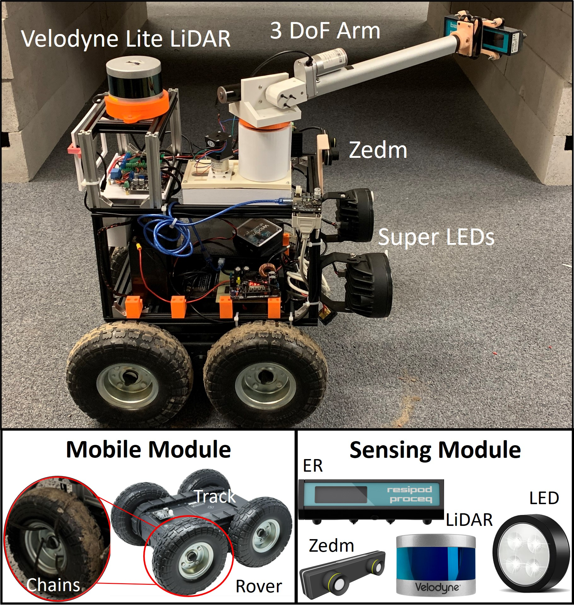
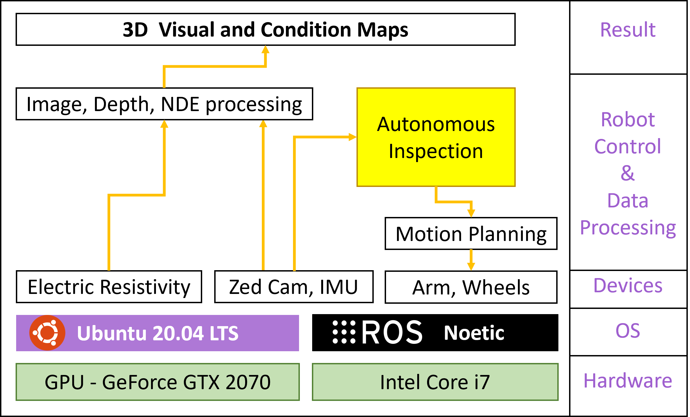

# CAIS: Culvert Autonomous Inspection Robotic System

**Culverts, essential components of drainage systems, require regular inspection to ensure their optimal functionality. However, culvert inspections pose numerous challenges, including accessibility, defect localization, and reliance on superficial visual assessments. To address these challenges, we propose a novel  Culvert Autonomous Inspection Robotic System (CAIS) equipped with advanced sensing and evaluation capabilities. Our solution integrates deep learning methodologies, lighting systems, and non-destructive evaluation (NDE) techniques to enable accurate defect localization and comprehensive condition assessment. We present a pioneering Partially Observable Markov Decision Process (POMDP) framework to resolve uncertainty in autonomous inspection, especially in confined and unstructured environments like culverts or tunnels. The framework outputs detailed 3D maps highlighting visual defects and NDE condition assessments, demonstrating consistent and reliable performance in various indoor and outdoor scenarios.**
<p align='center'>
    
</p>

## Dependencies
The framework has been tested with ROS Noetic and Ubuntu 20.04. The following configuration, along with the required dependencies, has been verified for compatibility:

- [Ubuntu 20.04](https://releases.ubuntu.com/focal/)
- [ROS Noetic](http://wiki.ros.org/noetic/Installation/Ubuntu) 
- [ZED SDK >= 3.5](https://www.stereolabs.com/developers)
- [CUDA](https://developer.nvidia.com/cuda-downloads) (Recommend to use CUDA toolkit >= 11 for Ubuntu 20.04)
- [ultralytics](https://github.com/ultralytics)

## ROS package
- [zed_ros-wrapper](https://github.com/stereolabs/zed-ros-wrapper)
- [zed-ros-example](https://github.com/stereolabs/zed-ros-examples)
- [roverrobotics_ros1](https://github.com/RoverRobotics/roverrobotics_ros1)
- [ros_numpy](https://github.com/eric-wieser/ros_numpy)
- [cv_bridge](https://github.com/ros-perception/vision_opencv)
- [velodyne](https://github.com/ros-drivers/velodyne)
- [culvert_explore]() (based on [explore_lite](https://github.com/UOW-SECTE-477/explore_lite))
- [detection]() (autonomous inspection node)
- [gmapping](https://github.com/ros-perception/slam_gmapping)
- [rosserial](https://github.com/ros-drivers/rosserial)
- [rosserial_arduino](http://wiki.ros.org/rosserial_arduino/Tutorials/Arduino%20IDE%20Setup)

## Flowchart
<p align='center'>
    
</p>

## Install
Use the following commands to download and build the package: (The code is implemented in ROS1)

```
    # caktin_ws or your workspace dir 
    mkdir -p ~/catkin_ws/src 
    cd ~/caktin_ws/src    
    git clone https://github.com/aralab-unr/CAIS.git
    cd ..
    catkin build
    source devel/setup.bash
```
## Run the package
```
    roslaunch detection auto_pro.launch

```

## Visual and Condition Assessment
Indoor            |  Outdoor
:-------------------------:|:-------------------------:
  |  
